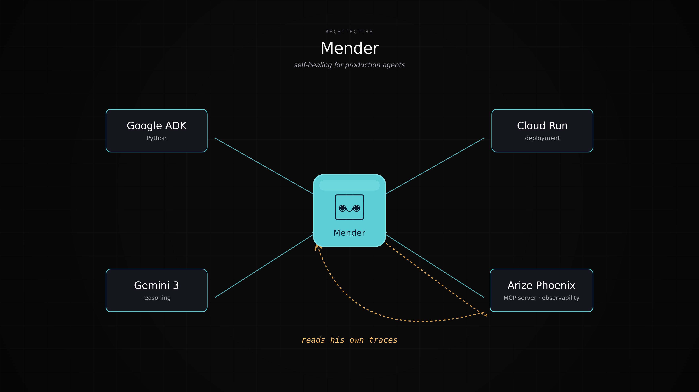

# Mender

> Catches the cracks. Mends them.

Mender is an autonomous agent that watches your production agents — reads their traces, finds quality regressions, hypothesizes the root cause, generates and runs targeted evals, proposes a fix, and asks you to approve it in Slack. Then it does the same for itself.

Built for the [Google Cloud Rapid Agent Hackathon](https://rapid-agent.devpost.com/) — Arize track.

## How it works

Every fifteen minutes, Mender wakes up and reads the last hour of traces from another agent (the "target") via the Arize Phoenix MCP server. It clusters failures, names the pattern, correlates against recent changes to the target's prompt or model, generates a focused eval set, runs it against the live target, drafts a prompt patch, runs the same evals against the patched version, and — if the patched version measurably improves — posts a structured incident report to Slack with one-click approval.

Mender also reads its **own** traces every cycle and tunes itself: how many evals to generate, what confidence threshold to use, when to ask for help. Over time, Mender gets better at the job.

## Stack

- **Agent runtime**: [Google ADK](https://google.github.io/adk-docs/) (Python)
- **Reasoning**: Gemini 3 (Vertex AI)
- **Observability**: [Arize Phoenix](https://arize.com/docs/phoenix) — traces, evals, datasets, experiments
- **Partner integration**: [`@arizeai/phoenix-mcp`](https://github.com/Arize-ai/phoenix/tree/main/js/packages/phoenix-mcp) — runtime introspection of operational data
- **Action surface**: Slack (Block Kit incident messages with interactive Approve/Discard)
- **Hosting**: Cloud Run (single service, autoscaled), triggered by Cloud Scheduler
- **State**: Firestore (or Cloud Storage JSON)
- **Secrets**: Google Secret Manager

## Architecture



Cloud Scheduler triggers Mender on Cloud Run every fifteen minutes. Mender uses Phoenix MCP to read both the target agent's traces *and* its own. Reasoning runs on Gemini 3. Eval runs hit the target agent over HTTP. Incident reports post to a Slack channel via webhook; the Approve button hits a Cloud Run endpoint that applies the patch atomically.

See [`docs/architecture.md`](docs/architecture.md) for the full breakdown.

## Project layout

```
mender-agent/
├── src/mender/
│   ├── agent.py          # ADK agent definition
│   ├── cli.py            # heartbeat entry point
│   ├── tools/            # Phoenix MCP wrappers
│   ├── pipeline/         # detect, hypothesize, eval, patch
│   ├── integrations/     # Slack
│   └── web/              # FastAPI app for UI + Slack callbacks
├── tests/
├── deploy/               # Cloud Run + Scheduler config
├── docs/
└── pyproject.toml
```

## Running locally

```bash
# Prerequisites
brew install --cask google-cloud-sdk
curl -LsSf https://astral.sh/uv/install.sh | sh

# Auth + project
gcloud auth login
gcloud auth application-default login
gcloud config set project <YOUR_PROJECT_ID>

# Phoenix Cloud (free) — get an API key from https://app.phoenix.arize.com
echo "PHOENIX_API_KEY=..." >> .env
echo "PHOENIX_COLLECTOR_ENDPOINT=..." >> .env

# Install + run
uv sync
uv run mender heartbeat --window 60m
```

## Deploying

```bash
# From repo root
gcloud run deploy mender --source . --region us-central1
gcloud scheduler jobs create http mender-heartbeat \
    --schedule "*/15 * * * *" \
    --uri https://mender-<hash>.run.app/heartbeat \
    --http-method POST
```

Full deploy walkthrough in [`deploy/README.md`](deploy/README.md).

## Status

Hackathon timeline: May 5 – June 11, 2026.

| Component | Status |
|---|---|
| FinPay Support (target agent) | not started |
| Phoenix instrumentation | not started |
| Mender brain (detect / eval / patch loop) | not started |
| Mender self-improvement (C11–C13) | not started |
| Slack action layer | not started |
| Web UI | not started |
| Deploy infra | not started |

## License

MIT — see [`LICENSE`](LICENSE).
